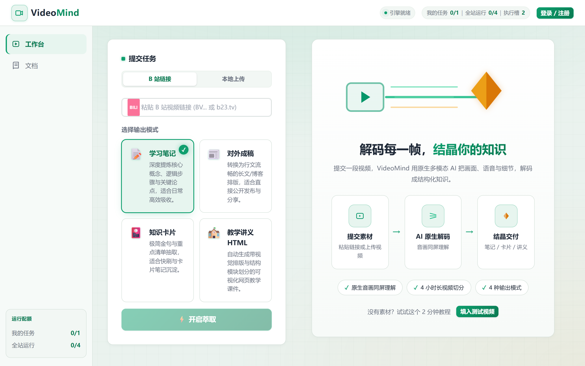
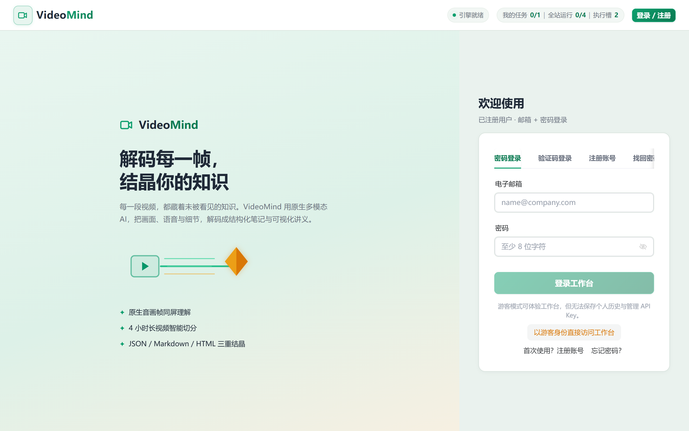

# 🎬 VideoMind

> 把视频变成结构化知识：**学习笔记 · 文章 · 复习卡片 · 教学网页**
> 自部署的完整技术栈：**服务端**（视频理解引擎 + Web 工作台）+ **客户端**（CLI / Agent Skill）

[](LICENSE)
[](https://www.python.org/)
[](https://fastapi.tiangolo.com/)
[](https://vuejs.org/)



VideoMind 会**真正看懂**视频——基于画面 + 声音的原生多模态理解，不是浅层字幕总结。它萃取操作步骤、方法论、关键观点，产出可交付的 Markdown 笔记与结构化 JSON。长视频（最长 4 小时）自动分段处理。

---

## ✨ 特性

- 🎯 **原生音画理解**：整段视频送入多模态模型，画面细节 + 语音内容同时理解，不是字幕压缩
  <br/>*（因此**必须使用支持原生视频理解的模型**，推荐 Gemini）*
- 📝 **四种产物**：学习笔记 / 对外成稿 / 知识卡片 / 教学讲义 HTML
- ✂️ **长视频分段**：>15 分钟自动切段（12 分钟 + 30 秒重叠），最长支持 4 小时
- ⚡ **一条命令**：`videomind <链接>` 提交 → 等待 → 保存，一步到位
- 🤖 **Agent Skill**：符合 [Agent Skills 开放标准](https://agentskills.io)，Claude Code / Codex 通用
- 🖥️ **自带工作台**：提交、实时进度、结果阅读器、历史记录、API Key 管理、管理后台
- 🔐 **生产就绪**：多用户体系、配额队列、任务归属隔离、Worker 自愈、密钥全部环境变量化

---

## 🏗️ 项目结构

```
videomind/
├── src/videomind/        # 客户端：CLI（Typer）
├── skills/videomind/     # 客户端：Agent Skill（Claude Code / Codex 通用）
├── tests/                # 客户端测试
└── server/               # 服务端
    ├── backend/          # FastAPI：理解管线、认证、配额、Worker 队列、管理后台
    ├── web/              # Vue 3 + Naive UI 前端
    └── deploy/           # systemd / Nginx / certbot 部署模板
```

**只想用？** 装客户端连已有服务端（见「配置」）。
**想自己跑一套？** 看 [`server/README.md`](server/README.md)。

---

## 🚀 快速开始

### 一、部署服务端

> ⚠️ **必须使用支持原生视频理解的模型**（如 Gemini 系列），推荐 **Gemini**。
> VideoMind 的核心能力是把整段视频（画面 + 声音）直接送入多模态模型理解，
> 纯文本模型或不支持视频输入的模型无法工作。默认配置 `gemini-3.6-flash-high`
> 已按 Gemini 的原生视频路由实现；换用其他模型前请确认其支持视频输入且端点兼容。
>
> **如何接入模型**：任何兼容 OpenAI / Gemini 原生视频路由的端点都可以。填你自己的
> 官方 API，或用下面的作者自营中转站（见「模型接入方式」）。

```bash
cd server/backend
pip install -r requirements.txt          # 系统依赖：ffmpeg、ffprobe、yt-dlp

cp .env.example .env                     # 填入上游端点、密钥与模型名
python -m uvicorn main:app --host 127.0.0.1 --port 8000
```

前端：

```bash
cd server/web
npm install && npm run build             # 产出 dist/，交给 Nginx 托管
```

> 完整的生产部署（systemd、Nginx、HTTPS 证书、并发调优）见 [`server/README.md`](server/README.md)。

### 模型接入方式

VideoMind 不绑定任何模型供应商，`OPENAI_BASE_URL` 指向哪个端点由你决定。两种常见选择：

**方式 A：官方 API（推荐用于生产）**

直接使用 Google Gemini 官方 API 或你信任的云厂商端点，稳定性和数据合规性最有保障：

```env
OPENAI_BASE_URL=https://generativelanguage.googleapis.com
OPENAI_API_KEY=你的官方密钥
DEFAULT_MODEL=gemini-3.6-flash-high
```

**方式 B：作者自营中转站（成本更低）**

> ⚠️ **透明声明**：`https://1127666.xyz` 是本项目作者（CjQkJ）自营的 API 中转站，
> 属于推广性质，非中立第三方推荐。它提供 Gemini 系列模型，价格约为官方定价的 1/5。
> 使用前请自行评估：你的视频内容与 API Key 会经过该中转站，请勿用于敏感数据场景。
> 你完全可以改用其他任何兼容端点，代码无需改动。

```env
OPENAI_BASE_URL=https://1127666.xyz
OPENAI_API_KEY=在中转站获取的密钥
DEFAULT_MODEL=gemini-3.6-flash-high
```

### 二、安装客户端

```bash
pip install videomind
```

或作为 Agent Skill 装进 AI agent：

```bash
npx skills add CjQkJ/videomind --agent claude-code -g -y
```

### 三、配置并开始使用

在服务端工作台的「API Keys」页面创建一个 `vw_` 开头的 Key，然后：

```bash
videomind config set-key vw_你的API密钥                      # 默认连本机 http://127.0.0.1:8000
videomind config set-key vw_你的API密钥 --base-url https://video.example.com   # 连远程

videomind "https://www.bilibili.com/video/BVxxxxxxxx"        # 提交 → 等待 → 保存
videomind "./demo.mp4" --mode cards -o ./notes/              # 本地视频 + 指定模式
```

也可用环境变量（优先级高于配置文件）：`VIDEOMIND_API_KEY`、`VIDEOMIND_BASE_URL`。

---

## 📋 命令参考

| 命令 | 说明 |
| :--- | :--- |
| `videomind <url-or-path>` | 一条龙：提交 → 等待 → 保存（本地路径会先上传） |
| `videomind submit <url>` | 仅提交，立即返回 `job_id` |
| `videomind status <job_id>` | 查询任务进度 |
| `videomind wait <job_id>` | 轮询直到成功/失败 |
| `videomind result <job_id>` | 下载结果（`-f md\|json\|html`，`-o` 指定路径） |
| `videomind jobs` | 列出历史任务（`-n` 限制条数） |
| `videomind health` | 服务状态与配额 |
| `videomind whoami` | 验证 Key、显示账号 |
| `videomind config set-key <key>` | 保存 API Key |
| `videomind config show` | 查看配置（Key 脱敏） |

---

## 🎨 输出模式

| `--mode` | 适用场景 | 产物 |
| :--- | :--- | :--- |
| `study_note` | 系统学习、做笔记（默认） | 结构化学习笔记：主旨 + 核心观点 + 章节拆解 + 方法论 + 案例 + 行动项 + 证据锚点 |
| `article` | 对外发布、博客 | 可读长文：核心论点高亮 + 引言 + 正文 + 实操指南 + 案例论据 + 行动号召 |
| `cards` | 复习、速记 | 知识卡片集：核心观点卡 / 方法步骤卡 / 案例卡 / 行动卡 / 证据锚点卡 |
| `teaching_html` | 教学、演示 | 可视化网页讲义：学习目标 + 教学章节 + 操作示范 + 案例解析 + 课后行动 |

---

## 🖥️ 服务端能力



| 能力 | 说明 |
| :--- | :--- |
| **输入** | B 站链接（含 b23 短链）、本地视频上传 |
| **理解模式** | `native`（整段视频原生理解，默认）/ `frames`（抽帧兜底）/ `auto`（自动降级） |
| **模型要求** | ⚠️ 必须支持原生视频理解（推荐 **Gemini**）；默认 `gemini-3.6-flash-high` 走 Antigravity 原生视频路由 |
| **用户体系** | 邮箱验证码登录、密码登录、注册、找回密码；JWT + API Key 双凭证 |
| **配额队列** | Guest 1 / User 2 / VIP 4，全站硬上限 4；DB Worker 原子领取 + 租约自愈 |
| **管理后台** | `ADMIN_EMAIL` 指定账号可见：用户管理、使用记录、API Key、模型热改 |
| **安全边界** | 任务归属隔离、DOMPurify Markdown、教学 HTML sandbox + CSP、上传大小限制 |
| **运维** | 任务终态自动清理媒体文件、子进程超时保护、worker 周期性租约恢复 |

---

## 🤖 作为 Agent Skill 使用

装好 skill 后，在 AI agent 里直接说：

> 「帮我总结这个视频：https://www.bilibili.com/video/BVxxxxxxxx」

agent 会自动调用 `videomind` CLI 提交、等待、读取笔记并给出摘要。

skill 只用标准 frontmatter（`name` + `description`），不依赖任何单一 agent 的专有字段，因此兼容 Claude Code、Codex 及任何遵循 [Agent Skills 开放标准](https://agentskills.io) 的工具。

---

## 🛠️ 开发

```bash
git clone https://github.com/CjQkJ/videomind.git
cd videomind

# 客户端
pip install -e ".[test]"
pytest                                    # 14 passed

# 服务端后端
cd server/backend
python -m pytest tests -q                 # 44 passed

# 服务端前端
cd ../web
npm install && npm test && npm run build  # 14 passed
```

---

## ❓ 常见问题

| 现象 | 处理 |
| :--- | :--- |
| `未配置 API Key` | 运行 `videomind config set-key <key>` 或设环境变量 |
| 连不上服务端 | 检查 `--base-url`、服务端是否启动，用 `videomind health` 验证 |
| 任务一直 `queued` | 并发已满，排队等待；或检查 Worker 服务是否运行 |
| 任务 `failed` | 多为源视频下载失败（B 站风控）或时长超限，换链接重试 |
| 想换输出形式 | 重新 `videomind <url> --mode cards`（服务端也可「重渲」不重跑 AI） |
| 磁盘占用增长 | 任务终态会自动清理视频媒体，仅保留结果文件 |

---

## 📄 License

MIT © CjQkJ
